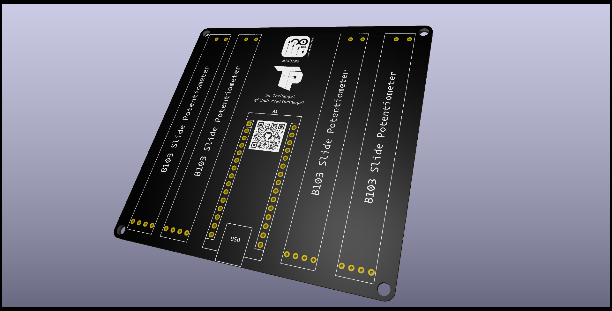

  

<h1 align="center">MixuinoPCB</h1>

<h3 align="center">A PCB for Mixuino the windows audio mixer built on Arduino</h3>

---------

<h3 align="center"> ⚠️ This repo is no longer maintained nor updated, it has been merged with the main [Mixuino repo](https://github.com/ThePangel/Mixuino) </h3>

-----

This is the ready to print PCB for the Mixuino project.

With 4 slide potentiometers and an Arduino NANO you will be all set to work with Mixuino.

Also with 4 mounting holes for all your mounting needs!

Some CAD files of my design for the complete mixer.

---
## Contact

Feel free to contact me [@ThePangel_](https://twitter.com/thepangel_) on Twitter/X or DM me on discord @thepangel

----
## Acknowledgement/Credit

- Logo: Inés D'Olha

---
